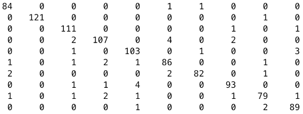
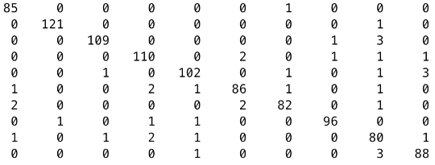
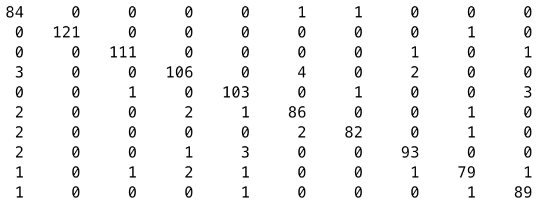

# Multi-class SVM

This repo is a matlab implementation of multi-class Support Vector Machine (SVM) from scratch.

### Algorithm Specification

Run [MultiClassSVM.m](https://github.com/yanweiw/multiclassSVM/blob/master/MultiClassSVM.m) will test 1-1 voting, 1-rest voting, and Directed Acyclic Graph (DAG) scheme respectively on MNIST data. More on DAG SVM can be found in the paper [Large Margin DAGs for Multiclass Classification](https://pdfs.semanticscholar.org/9c59/b8c3ad59e3466340eac29d1b322dc71546ad.pdf).

### Results

I used polynomial kernel in all three cases, and the results are presented in confusion matrix. The vertical axis of the matrix is for the ground truth 0 - 9, and the horizontal axis is for the estimated class label.

**SVM 1-1 voting (polynomial degree = 3), accuracy: 95.5%**

<!--  -->

**SVM 1-rest voting (polynomial degree = 4), accuracy: 95.9%**

**DAGSVM (polynomial degree = 3), accuracy: 95.4%**

### Analysis

1-1 scheme compares testing data to every one of 45 classifiers. Data will only respond strongly to classifiers that include the test data ground truth. The shortage of this means is ambiguity of classification when multiple binary classifiers are present. We thus choose the maximum votes for prediction to assuage this problem. Another way of avoiding ambiguity is to use direct acyclic graph, which presented in the DAGSVM scheme. However, ambiguity still persists to some extent. Since DAGSVM uses the same 1-1 classifiers, thus the same training method, although in different—tree traversing—manner to test data, the confusion matrix results are similar for 1-1 and DAGSVM. After several trials, I find polynomial degree 3 is best for my implementation.

1-rest scheme works by training 10 1-rest classifiers, which albeit fewer are slower to train than each of 1-1 scheme’s classifier. In testing, we use as our prediction the class with maximum y value, because ground truth should respond most strongly to the classifier including the class despite noise of rest classes. Besides the usual ambiguity in multiclass classification, this scheme also faces the problem of scale imbalance and data imbalance. Luckily we have almost equally split data for different class in our training, and instead of -1 I use -1/(K-1) as target for rest classes to assuage the problem of scale imbalance. After several trials, polynomial degree of 4 works best for this scheme, achieving almost 96% accuracy. The reason this scheme performs better than the other two schemes might have been that 1-1 classifiers usually need way more training data set for it to perform better.  

For more information, you can find me at my [portfolio page](https://yanweiw.github.io/).
Cover photo credit to [MNIST Google Image](https://knowm.org/mnist-hand-written-digits-classification-benchmark/).
